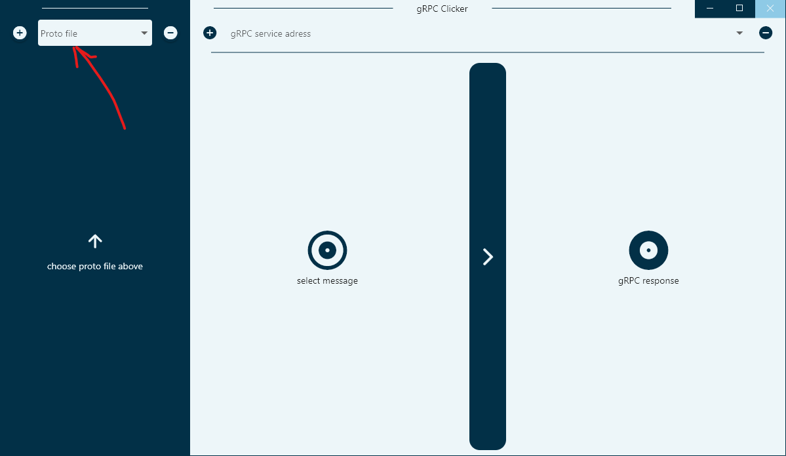
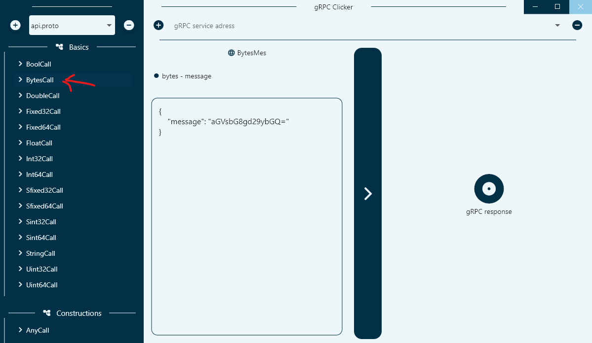
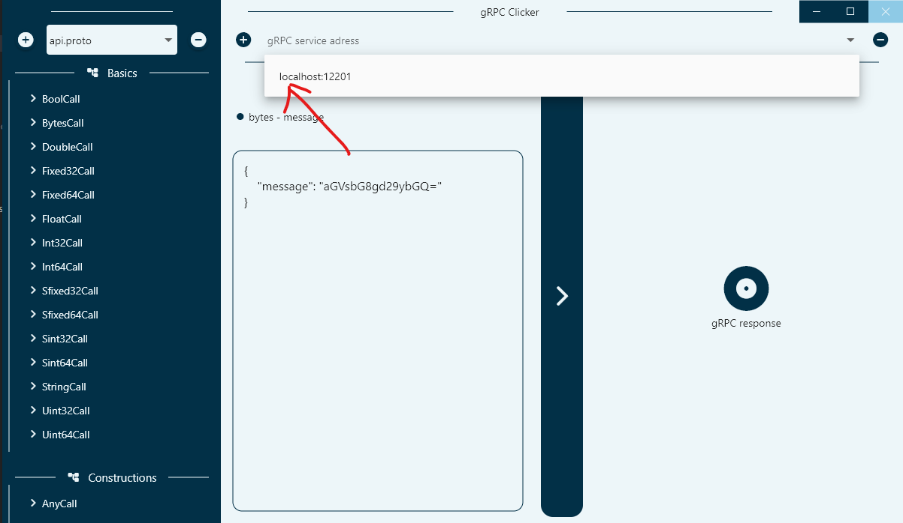
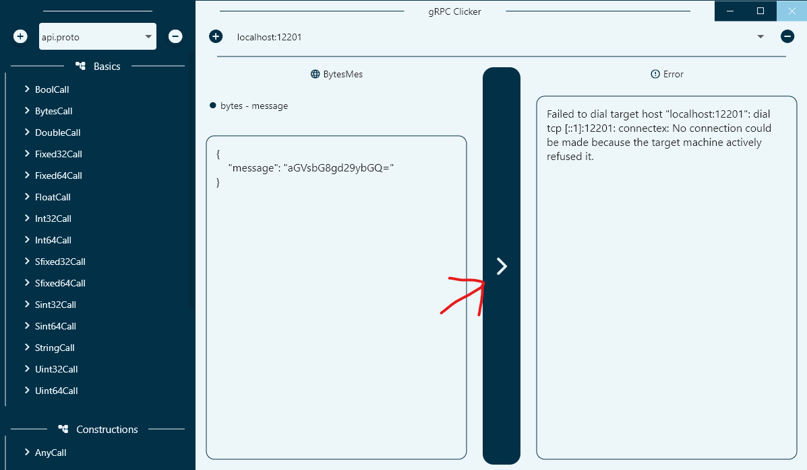

# gRPC Clicker

<p align="center">
 
</p>

gRPC-Clicker is cross-platform application for testing [gRPC](https://grpc.io) API's.

Application is built with [flutter](https://flutter.dev), but under the hood it uses [grpcurl](https://github.com/fullstorydev/grpcurl).

To use this application you have to have `grpcurl` installed on your machine, which can be done with command (if you have go installed):

```cmd
go install github.com/fullstorydev/grpcurl/cmd/grpcurl@latest
```

## Downloads

Downloads can be found for different platforms over here: [downloads](download/)

Currently supported platforms:
- *Windows*
- *Macos* (first launch on macos should be done with terminal to avoid crashes)

## Usage

1. Add your proto file:
   
2. Select message to invoke, fill the params as `json`:
   
3. Add adress:
   
4. Make a call:
   

---

### Currently supported features:

- Api schema parser
- Body autofilling
- Requests as json's
- Send request and get responses

### To be supported features:

- add support for *linux*
- gRPC streams
- Request history
- complex bodies
- tests and tests groups
- Request body caching
- Request body saving
